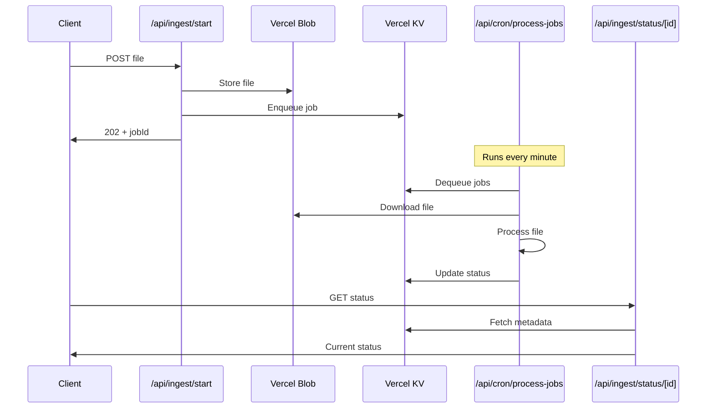

# 🚀 Asynchronous File Ingestion System

This document describes the complete asynchronous file ingestion system built using Vercel's native infrastructure (Blob, KV, and Cron Jobs).

## 📋 System Overview

The async ingestion system transforms the synchronous file processing into a robust, scalable queue-based system that can handle large files and high throughput without blocking user requests.

### Architecture Components

1. **Upload Endpoint** (`/api/ingest/start`) - Accepts files and queues them
2. **Job Queue** (Vercel KV) - Stores and manages processing jobs
3. **Cron Processor** (`/api/cron/process-jobs`) - Processes queued jobs
4. **Status Tracking** (`/api/ingest/status/[jobId]`) - Real-time job status
5. **File Storage** (Vercel Blob) - Temporary file storage during processing

## 🔄 Processing Flow



## 🛠️ API Endpoints

### 1. Start Async Ingestion
**POST** `/api/ingest/start`

Upload a file for asynchronous processing.

**Request:**
```bash
curl -X POST \
  -F "file=@script.pdf" \
  -F "priority=high" \
  -F "userId=user123" \
  https://your-app.vercel.app/api/ingest/start
```

**Response:**
```json
{
  "success": true,
  "jobId": "job_clh1234567890",
  "message": "File uploaded successfully and queued for processing",
  "estimatedProcessingTime": "2-3 minutes",
  "statusUrl": "/api/ingest/status/job_clh1234567890"
}
```

### 2. Check Job Status
**GET** `/api/ingest/status/[jobId]`

Get real-time status of a processing job.

**Response:**
```json
{
  "success": true,
  "jobId": "job_clh1234567890",
  "status": "processing",
  "progress": {
    "currentStep": "Processing file",
    "percentage": 65,
    "details": "Extracting text content from PDF"
  },
  "file": {
    "name": "script.pdf",
    "size": 2048576,
    "type": "application/pdf"
  },
  "timestamps": {
    "createdAt": "2024-01-15T10:30:00Z",
    "startedAt": "2024-01-15T10:31:00Z"
  }
}
```

### 3. Queue Management (Admin)
**GET** `/api/admin/queue`

Get queue statistics and system health.

**POST** `/api/admin/queue`

Perform queue management operations:
```json
{
  "action": "cleanup",
  "daysOld": 7
}
```

## 📊 Job Status Types

| Status | Description |
|--------|-------------|
| `pending` | Job is queued, waiting for processing |
| `processing` | Job is currently being processed |
| `completed` | Job completed successfully |
| `failed` | Job failed and cannot be retried |
| `retrying` | Job failed but will be retried |

## ⚙️ Configuration

### Environment Variables

```bash
# Vercel Blob (automatically set by Vercel)
BLOB_READ_WRITE_TOKEN=vercel_blob_rw_...

# Vercel KV (automatically set by Vercel)
KV_URL=redis://...
KV_REST_API_URL=https://...
KV_REST_API_TOKEN=...
KV_REST_API_READ_ONLY_TOKEN=...

# Cron Security
CRON_SECRET=your-secure-random-string
```

### Vercel Configuration

```json
{
  "crons": [
    {
      "path": "/api/cron/process-jobs",
      "schedule": "* * * * *"
    }
  ]
}
```

## 🔧 Key Features

### 1. **Robust Error Handling**
- Automatic retry with exponential backoff
- Detailed error messages and suggestions
- Graceful failure handling

### 2. **Priority Queue System**
```typescript
const priorities = {
  urgent: 1,   // Processed first
  high: 2,
  medium: 3,   // Default
  low: 4       // Processed last
};
```

### 3. **Real-time Progress Tracking**
- Step-by-step progress updates
- Percentage completion
- Detailed status messages

### 4. **Concurrent Processing Prevention**
- Distributed locks using KV
- Prevents multiple cron instances from conflicting
- Automatic lock expiration

### 5. **File Management**
- Secure temporary storage in Vercel Blob
- Automatic cleanup of processed files
- Private file access

## 🛡️ Security Features

### 1. **Cron Authentication**
```typescript
// Verify requests are from Vercel Cron
const authHeader = request.headers.get('authorization');
if (authHeader !== `Bearer ${process.env.CRON_SECRET}`) {
  return unauthorized();
}
```

### 2. **File Validation**
- Same validation as synchronous endpoint
- Size limits, type checking, content validation
- Secure blob storage with private access

### 3. **Job ID Security**
- Cryptographically secure job IDs using `cuid2`
- Prevents job ID prediction or enumeration

## 📈 Performance Characteristics

### Throughput
- **Batch Size**: 5 jobs per cron run
- **Frequency**: Every minute (60 jobs/hour max)
- **Concurrent**: Single processing lock prevents overload

### Timeouts
- **Job Timeout**: 30 seconds per job
- **Cron Timeout**: 5 minutes total per run
- **Lock Timeout**: 5 minutes (auto-release)

### Retry Logic
- **Max Attempts**: 3 retries per job
- **Backoff**: Exponential (60s, 120s, 240s)
- **Retry Conditions**: Network errors, timeouts, temporary failures

## 🔍 Monitoring & Debugging

### 1. **Queue Statistics**
```bash
curl https://your-app.vercel.app/api/admin/queue
```

**Response:**
```json
{
  "queue": {
    "totalJobs": 150,
    "completedJobs": 140,
    "failedJobs": 5,
    "pendingJobs": 5,
    "lastProcessedAt": "2024-01-15T10:35:00Z"
  }
}
```

### 2. **Job Debugging**
Each job includes detailed error information:
```json
{
  "error": {
    "type": "extraction_failed",
    "message": "PDF parsing failed: encrypted document",
    "retryable": false,
    "retryCount": 1,
    "stackTrace": "..."
  }
}
```

### 3. **System Monitoring**
- Memory usage tracking
- Processing time metrics
- Queue depth monitoring
- Error rate tracking

## 🚀 Deployment Checklist

### Vercel Setup
1. **Enable Vercel Blob**:
   ```bash
   vercel env add BLOB_READ_WRITE_TOKEN
   ```

2. **Enable Vercel KV**:
   ```bash
   vercel kv create job-queue
   ```

3. **Set Cron Secret**:
   ```bash
   vercel env add CRON_SECRET production
   ```

### Configuration
1. ✅ Add cron job to `vercel.json`
2. ✅ Update environment variables
3. ✅ Deploy and test endpoints
4. ✅ Verify cron job execution

### Testing
```bash
# Test file upload
curl -X POST -F "file=@test.pdf" \
  https://your-app.vercel.app/api/ingest/start

# Check job status
curl https://your-app.vercel.app/api/ingest/status/job_xxx

# Trigger manual processing (development)
curl https://your-app.vercel.app/api/cron/process-jobs

# Check queue stats
curl https://your-app.vercel.app/api/admin/queue
```

## 🔄 Migration from Sync to Async

### Client Code Changes

**Before (Synchronous):**
```typescript
const response = await fetch('/api/ingest', {
  method: 'POST',
  body: formData
});
const result = await response.json();
// Immediate result available
```

**After (Asynchronous):**
```typescript
// 1. Start processing
const response = await fetch('/api/ingest/start', {
  method: 'POST',
  body: formData
});
const { jobId } = await response.json();

// 2. Poll for status
const pollStatus = async () => {
  const statusResponse = await fetch(`/api/ingest/status/${jobId}`);
  const status = await statusResponse.json();

  if (status.status === 'completed') {
    // Process result
    return status.result;
  } else if (status.status === 'failed') {
    // Handle error
    throw new Error(status.error.message);
  } else {
    // Continue polling
    setTimeout(pollStatus, 2000);
  }
};

await pollStatus();
```

## 🎯 Benefits

### For Users
- ✅ **Immediate Response**: No waiting for large file processing
- ✅ **Progress Updates**: Real-time processing status
- ✅ **Reliable Processing**: Automatic retries for transient failures

### For System
- ✅ **Scalability**: Handle multiple files simultaneously
- ✅ **Reliability**: Persistent queue survives deployments
- ✅ **Resource Management**: Controlled processing load
- ✅ **Monitoring**: Complete visibility into processing pipeline

### For Development
- ✅ **Separation of Concerns**: Upload vs. processing logic
- ✅ **Testability**: Individual components can be tested
- ✅ **Maintainability**: Clear error handling and logging
- ✅ **Observability**: Detailed metrics and debugging info

---

**🚀 The async ingestion system is now ready for production deployment with robust error handling, monitoring, and scalability!**