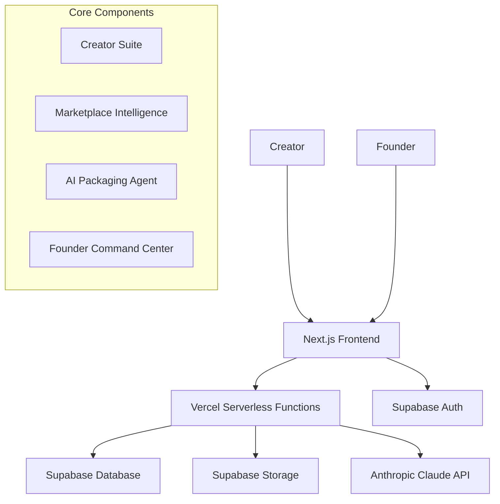

# Project Manthan Documentation

> **The Strategic Blueprint for India's AI-Native Media Operating System**

This directory contains the complete documentation for Project Manthan, an AI-native operating system designed to transform India's Media & Entertainment industry through a unified "Concept-to-Contract" platform.

## 📋 Documents Overview

### 📊 Strategic Blueprint (`strategic-blueprint.md`)
**The Definitive Strategic Foundation**

Comprehensive strategic analysis covering:
- **Market Validation**: Quantified pain points in Indian creator economy (90% earn <₹18k/month)
- **Product Vision**: Dual-flywheel architecture (Creator Suite + Marketplace Intelligence)
- **Competitive Analysis**: Defensible moats through data flywheel and hyper-verticalization
- **Monetization Strategy**: Hybrid SaaS + Marketplace + DaaS model
- **Go-to-Market Plan**: 3-phase strategy from community validation to enterprise dominance
- **Legal Framework**: DPDP Act 2023 compliance and copyright strategy

### ⚙️ MVP Implementation Blueprint (`mvp-implementation.md`)
**The Technical Implementation Roadmap**

Detailed technical guide covering:
- **Architecture**: Vercel + Supabase + Claude API serverless stack
- **Database Schema**: Complete PostgreSQL schema with RLS policies
- **API Design**: RESTful endpoints for creator and founder workflows
- **AI Strategy**: 6-step prompt chain for script-to-pitch transformation
- **Security**: Row-level security and data protection compliance
- **Build Guide**: Cloud-only development using GitHub Codespaces
- **Production Prompts**: Copy-paste prompts for Claude Code implementation

## 🏗️ System Architecture

## 🎯 MVP Strategy: "Managed Marketplace"

**Focus**: Accelerated path for established creators with existing scripts
**Model**: Human-in-the-loop service to solve marketplace cold-start problem
**Goal**: Close 3-5 deals with founding cohort of 20-30 creators + 5-10 buyers

### Key Differentiators
1. **Hyper-Verticalization**: Deep focus on Indian M&E industry specifics
2. **Data Flywheel**: Proprietary intelligence from concept-to-contract pipeline
3. **Trust-First**: Creator's Bill of Rights and DPDP compliance
4. **Cultural Intelligence**: India-specific AI training and localization

## 🛠️ Technology Stack

| Component | Technology | Purpose |
|-----------|------------|---------|
| **Frontend** | Next.js + TypeScript + Tailwind CSS | Modern web application with server-side rendering |
| **Backend** | Vercel Serverless Functions (Python) | Cost-effective, auto-scaling API endpoints |
| **Database** | Supabase (PostgreSQL) | Managed database with built-in auth and real-time features |
| **Storage** | Supabase Storage | Secure file storage for scripts and generated assets |
| **Authentication** | Supabase Auth | User management with Row-Level Security |
| **AI Engine** | Anthropic Claude 3 Opus | 200K context window for full script processing |
| **Deployment** | Vercel | Automatic deployments with global CDN |
| **Development** | GitHub Codespaces | Cloud-based development environment |

## 📊 Database Schema

### Core Tables
- **`profiles`**: User management extending Supabase auth
- **`projects`**: Creator projects with metadata for ML training
- **`script_uploads`**: File metadata for uploaded scripts
- **`generated_assets`**: AI-generated pitch materials
- **`platform_mandates`**: Founder's proprietary market intelligence
- **`deal_pipeline`**: Deal tracking for success prediction training

### Security Model
- **Row-Level Security (RLS)** on all tables
- **Role-based access**: Creator vs Founder permissions
- **Data isolation**: Users can only access their own projects
- **Admin access**: Founder role has full visibility for marketplace management

## 🤖 AI Packaging Agent

**6-Step Prompt Chain Process:**

1. **Structural Analysis** → Parse screenplay format
2. **Core Elements Extraction** → Generate logline, synopsis, themes, characters (JSON output)
3. **Character Bible Generation** → Detailed character profiles for each main character
4. **Format Adaptation** → Platform-specific adaptation using mandate database
5. **Pitch Deck Content** → Synthesize professional pitch materials
6. **Document Assembly** → Create formatted DOCX/PDF output

**Key Features:**
- **200K token context** for full script processing
- **Cultural intelligence** through India-specific training data
- **Market-driven adaptation** using proprietary platform mandates
- **Human-in-the-loop** review and refinement

## 🚀 Implementation Phases

### Phase 0: Foundation (Hour 1)
- Deploy Vercel + Supabase template
- Set up GitHub Codespaces environment
- Configure automatic deployments

### Phase 1: Authentication & Profiles (Days 1-2)
- Implement Supabase Auth with middleware
- Create role-based access control
- Build Creator's Bill of Rights consent flow

### Phase 2: Creator Project Ingestion (Days 3-5)
- Build project creation and management
- Implement secure file upload with signed URLs
- Create project dashboard

### Phase 3: AI Packaging Agent (Days 6-10)
- Implement prompt chain in Python serverless functions
- Integrate Claude 3 Opus API
- Build document generation pipeline

### Phase 4: Founder Command Center (Days 11-15)
- Create admin dashboard for project oversight
- Build platform mandates management
- Implement deal pipeline tracking

## 📈 Success Metrics

### MVP Phase (Months 1-6)
- **Projects Processed**: 20-30 high-quality projects
- **Deals Closed**: 3-5 successful transactions
- **Market Intelligence**: 50+ platform mandate entries
- **User Satisfaction**: High NPS from founding cohort

### Growth Phase (Months 6-18)
- **User Acquisition**: 10,000+ free tier users
- **Conversion Rate**: 5-10% free to paid conversion
- **Revenue**: First $100K ARR milestone
- **Market Position**: Recognized industry standard

## 🔒 Compliance & Security

### Data Protection (DPDP Act 2023)
- **Explicit consent** for all data processing
- **Purpose limitation** for AI training and marketplace functions
- **User rights** dashboard for data management
- **Breach notification** protocols

### Intellectual Property
- **Creator ownership** of all generated content
- **AI as tool** positioning for copyright compliance
- **Audit trail** for creative process documentation
- **No training** on user IP without explicit consent

## 🌟 Getting Started

### For Developers
1. **Read the MVP Implementation Blueprint** for detailed technical specs
2. **Use the provided prompts** with Claude Code for guided development
3. **Follow the phased approach** for systematic implementation
4. **Leverage the cloud-only workflow** for streamlined development

### For Stakeholders
1. **Review the Strategic Blueprint** for market analysis and business strategy
2. **Understand the MVP approach** for risk mitigation and rapid validation
3. **Assess the compliance framework** for legal and ethical considerations
4. **Evaluate the monetization model** for revenue projections

## 📞 Key Contacts & Resources

- **Technical Implementation**: Follow MVP Implementation Blueprint
- **Strategic Decisions**: Refer to Strategic Blueprint
- **AI Development**: Use provided prompt library
- **Compliance Questions**: Review legal framework section

## 🎯 Next Steps

1. **Initialize Project**: Set up development environment using implementation guide
2. **Build MVP**: Follow phased development approach
3. **Recruit Cohort**: Identify and onboard founding creators and buyers
4. **Launch & Iterate**: Deploy managed marketplace and gather feedback
5. **Scale**: Transition to product-led growth based on validated learnings

---

*This documentation is designed to be the single source of truth for Project Manthan development. All implementation decisions should trace back to the strategic rationale outlined in these documents.*
